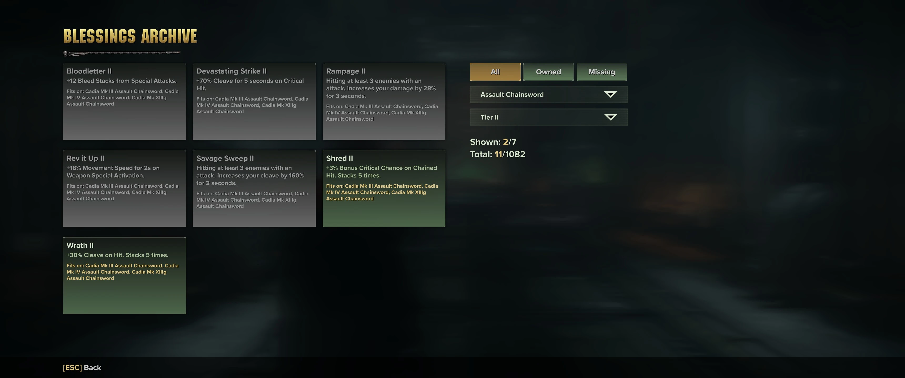

# Blessings Archive
Blessings Archive is a modification for Warhammer 40.000 Darktide that adds a custom Blessings 
Archive screen that displays all weapon blessings available in the game. You can toggle the screen 
with a hotkey (F6 by default, configurable from the mod options).

Information about blessings includes title, rarity, description, and a list of compatible weapons. 
Blessings are sorted by name and rarity, and you can further filter them down by weapon category, 
rarity and earned/unearned state.

You can find more information about the mod on [Nexus](https://www.nexusmods.com/warhammer40kdarktide/mods/310?tab=description).
